RnD API Management : Securing APIs using thirdparty OAuth2 identity provider support in API Gateway  

1.  [RnD API Management](index.html)

RnD API Management : Securing APIs using thirdparty OAuth2 identity provider support in API Gateway
===================================================================================================

Created by Thangavelu, Dharmaraj, last modified by James, Clench Paign on Apr 26, 2018

##### Author: [Thangavelu, Dharmaraj](https://iwiki.eur.ad.sag/display/~DTH) (dth@softwareag.com)

#### Supported Versions:

10.1

Overview of the tutorial
========================

This tutorial helps to understand how a third party OAuth 2 identity provider and authorization server can be configured in API Gateway to secure the APIs using OAuth 2 authorization. The third party OAuth 2 authorization server which is configured in API Gateway should support Dynamic Client Registration defined by the RFC-7591: [https://tools.ietf.org/html/rfc7591](https://tools.ietf.org/html/rfc7591). Some of the providers who already provide this support are OKTA and PingFederate. In this case the API Gateway still remains as the Resource server.

In this tutorial we will use OKTA as our OAuth 2 identity provider and go through the following steps in detail.

*   Configuring OKTA as OAuth 2 Provider  
    *   Obtaining a token from OKTA
    *   Creating an auhtorization server namespace in OKTA
    *   Obtaining Metadata URI and endpoints from OKTA
*   Configuring OKTA third-party OAuth 2 provider in API Gateway
*   Configuring OKTA third-party OAuth 2 authorization server in API Gateway
*   Creating a consumer application in API Gateway
*   Configuring external authorization server in Integration Server
*   Invoking the OAuth 2 protected API using postman client

Required knowledge
==================

The tutorial assumes the reader has,

*   a good knowledge on the OAuth 2 authorization framework.
*   already gone through the tutorial about **[Securing APIs using OAuth2 in API Gateway](https://iwiki.eur.ad.sag/display/RNDWMGDM/Securing+APIs+using+OAuth2+in+API+Gateway)**

Why?
====

While the API Gateway provides out of the box support for the built in OAuth 2 authorization server (the one which is provided by the Integration Server) there are some customers out there who already have authorization servers existing in their production environment. They are bound to use only the authorization server which comes along with the product and this makes them restricted to not use their servers. Hence to help the existing customer base to use their existing OAuth 2 provider, the API Gateway provides support for the configuration and usage of third party OAuth 2 identity providers to secure the APIs using OAuth 2.

Prerequisite steps
==================

Complete the below prerequisites to make you ready to get into the details of the Third party OAuth 2 identity provider support in API Gateway.

*   Install API Gateway of version 10.1
*   Create a tenant account in OKTA identity provider management portal
*   Install postman REST client of version >= v6.0.10
*   Install the attached IS package (WmEmployeeManagementSample.zip) for our tutorial's native REST service  
    
*   Create a REST API in API Gateway using the attached Swagger file (EmployeeManagementSwagger.json)
*   Edit the REST API and add the Outbound Authentication - Transport policy with Basic Authentication scheme as the native service is protected with Basic authentication. The credentials are Administrator / manage.

Details
=======

Step 1: Configuring OKTA as OAuth 2 Provider
--------------------------------------------

### Token creation

First and foremost thing of this tutorial is to create a token in the OKTA tenant account to access all the OKTA endpoints from API Gateway.

Login into OKTA and Go to  **API** → **Tokens**

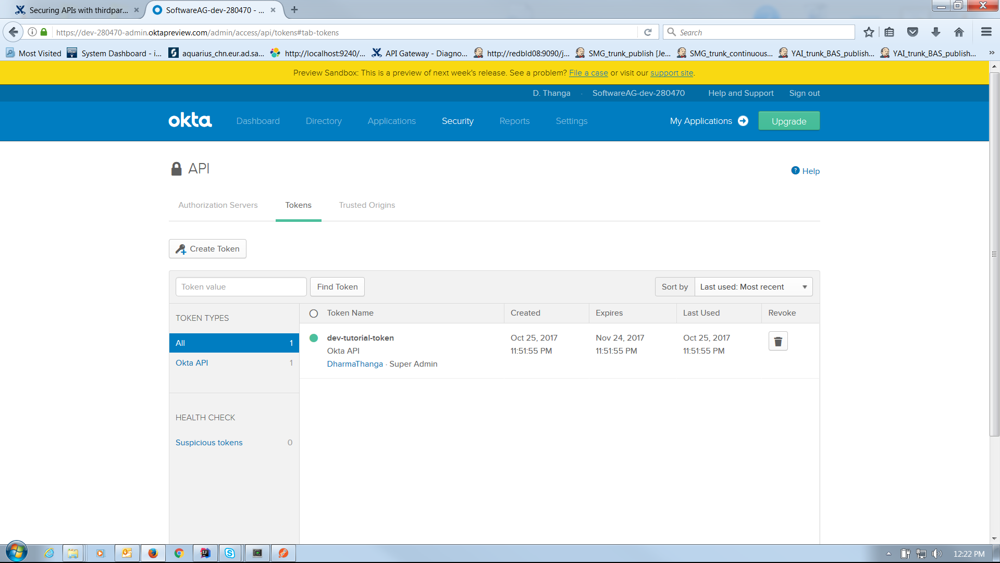

  

Click on **Create Token**, give a name and submit. **Save** the token for future use since that will be the only time you will be viewing it.

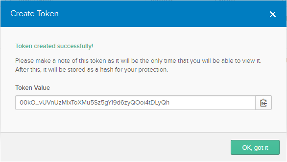

### Authorization server creation

The next thing is to create an authorization server namesapce in OKTA.

Go to  **API** → **Authorization Servers**

Click **Add Authorization Server** and provide the _Name_, _Audience_ and _Description_ and **Save**.

### **Obtaining Metadata endpoints from OKTA**

The Metadata endpoints for Client registration, Client Update, Scope creation, etc at the third party OAuth authorization server can be obtained by accessing the Metadata URI.

Select the Authorization server and find the **Metadata URI** in the **Settings**. 

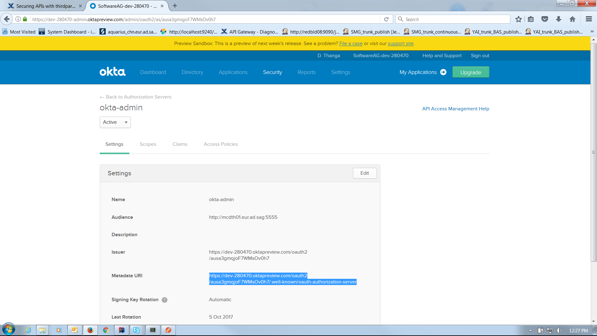

 Invoke the Metadata URI from the the browser and you will get all the endpoint URLs in the response.

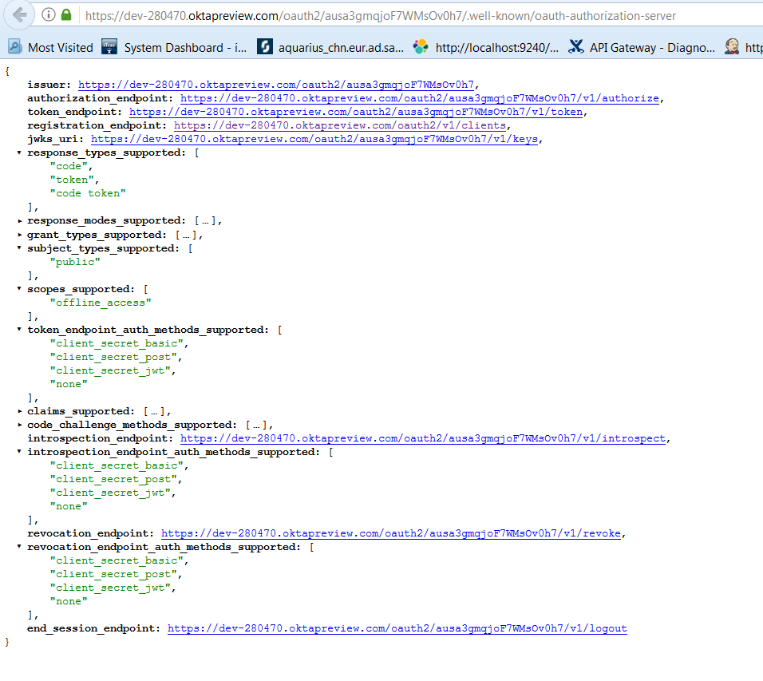

Step 2: Configuring OKTA OAuth 2 provider in API Gateway
--------------------------------------------------------

API Gateway comes with the predefined providers OKTA and PingFederate in the Third party OAuth 2 configuration. You can also create your own identity providers by following the below steps:

Go to **Adminitration** → **Security** → **OAuth 2.0**. Click **Add provider** and provide the details.

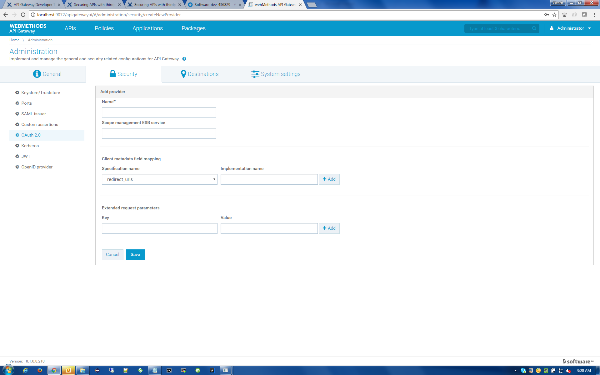

For the tutorial purpose we can take the predefined provider OKTA as our identity provider.

### Scope management ESB service

The OAuth 2.0 scope management does not have any predefined standards, and the implementation for managing the OAuth 2.0 scopes would vary with different providers. API Gateway 10.1 ships with OKTA and PingFederate third party providers and the API Provider can make use of any of these to configure the third party OAuth authorization server. But in some cases the API Provider may want to use an OAuth 2.0 provider other than these two out of the box providers. Additionaly, in some other cases the scope management APIs provided by OKTA or PingFederate might be changed by those providers and the API Provider wants to adopt those changes by providing his implementation. In such cases, to handle these scenarios the API Gateway provides an option to specify an ESB service in the OAuth 2.0 provider configuration using which the API Provider can manage the scopes in the third party OAuth 2.0 provider. At runtime the API Gateway invokes this ESB service to do OAuth 2.0 scope management in the third party server.

In the API Gateway UI the ESB service can be given in the **_Scope management ESB service_** input field and the API Gateway invokes it with certain parameters to accomplish the scope management. Some of the parameters are action, scopeName, scopeDescription, providerName, endpoints and authorizationInfo. A details explanation of these parameters can be found in the _"webMethods API Gateway User's Guide"_ documentation. A sample scope management ESB service is attached in this tutorial and can be found under Downloadable Artifacts section. The below screen shot shows a third party OAuth 2 provider configuration with Scope management ESB service.

Step 3: Configuring OKTA OAuth 2 authorization server in API Gateway
--------------------------------------------------------------------

The next thing is to create the authorization server alias in API Gateway for the OKTA authorization server we created in Step 1. The API Gateway uses this alias to register a client, create a scope, etc with OKTA authorization server.

The below steps provide how to create an authorization server alias in API Gateway:

Go to **Adminitration** → **Security** → **OAuth 2.0**. Click **Add authorization server** and provide the below details.

  
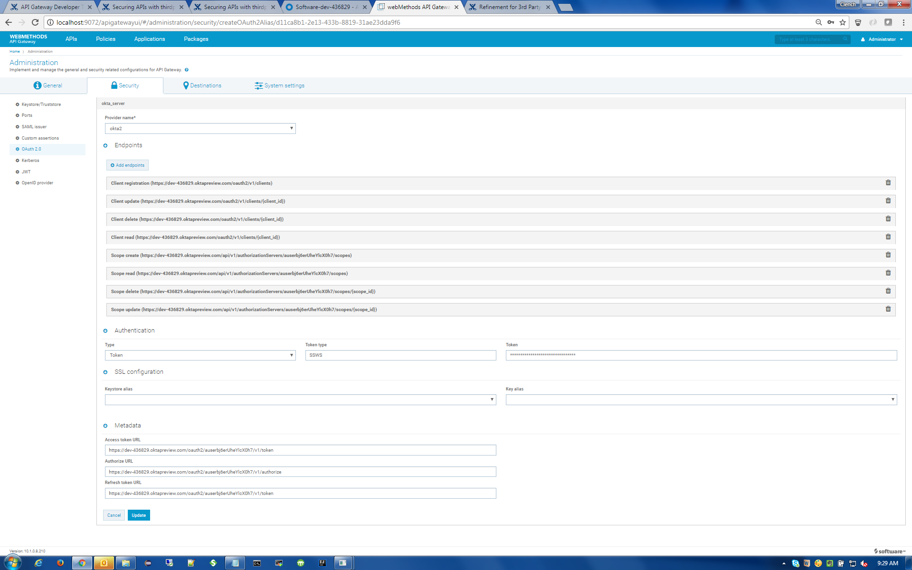

#### Provider name

Select the OAuth 2 identity provider which we configured in Step 2, in our case it is the predefined one OKTA.

#### Endpoints

Add the endpoints for client registration, scope creation, etc in this section. The endpoint URLs can be taken from the response we got from the Metadata URI in Step 1.

The following information is specific to OKTA and the details will vary depends on the provider. These endpoints are part of Dynamic Client Registration endpoints and could be obtained from their documentation.

##### Client Registration

Using this endpoint API Gateway creates an OKTA application in OKTA Authorization server.

This endpoint can be obtained from the metadata URI with key **_registration\_endpoint_**. Here it is **_[https://dev-280470.oktapreview.com/oauth2/v1/clients](https://dev-280470.oktapreview.com/oauth2/v1/clients)_  
**

##### **Client Read**

Using this endpoint API Gateway reads an OKTA application from the OKTA Authorization server.

This Can be obtained from the client registration endpoint: You will have to add "{client\_id}", in places where the client id parameter is specified in the URL as per the documentation.

_**[https://dev-280470.oktapreview.com/oauth2/v1/clients](https://dev-280470.oktapreview.com/oauth2/v1/clients)/{client\_id}  
**_

##### **Client Update**

Using this endpoint API Gateway updates an OKTA application in OKTA Authorization server.

Similarly it is **_[https://dev-280470.oktapreview.com/oauth2/v1/clients](https://dev-280470.oktapreview.com/oauth2/v1/clients)/{client\_id}_**

##### **Client Delete**

Using this endpoint API Gateway deletes and OKTA application from OKTA Authorization server

It is **_[https://dev-280470.oktapreview.com/oauth2/v1/clients](https://dev-280470.oktapreview.com/oauth2/v1/clients)/{client\_id}_** here.

#### **Scope Creation endpoints**

The below endpoints are used to do the CRUD of scopes in the OKTA authorization server.

[ausa3gmqjoF7WMsOv0h7](https://dev-280470.oktapreview.com/oauth2/ausa3gmqjoF7WMsOv0h7) is the authorization server id used in this example.

##### **Scope Create**

_**[https://dev-280470.oktapreview.com/api/v1/authorizationServers/ausa3gmqjoF7WMsOv0h7](https://dev-280470.oktapreview.com/oauth2/ausa3gmqjoF7WMsOv0h7)/scopes**_

##### **Scope Update**

_****[https://dev-280470.oktapreview.com/api/v1/authorizationServers/ausa3gmqjoF7WMsOv0h7](https://dev-280470.oktapreview.com/oauth2/ausa3gmqjoF7WMsOv0h7)/scopes**/{scope\_id}**_

##### **Scope Read**

_****[https://dev-280470.oktapreview.com/api/v1/authorizationServers/ausa3gmqjoF7WMsOv0h7](https://dev-280470.oktapreview.com/oauth2/ausa3gmqjoF7WMsOv0h7)/scopes****_

Note that there is no scope\_id mentioned in scope read, as we use the bulk read api of OKTA. 

##### Scope Delete

_****[https://dev-280470.oktapreview.com/api/v1/authorizationServers/ausa3gmqjoF7WMsOv0h7](https://dev-280470.oktapreview.com/oauth2/ausa3gmqjoF7WMsOv0h7)/scopes**/{scope\_id}**_

#### Authentication

Here we have to provide the authentication credentials to access all the endpoints with the OKTA authorization server.

Select **_Token_** as the type, **_SSWS_** as the token type and give the token value which we obtained in Step 1.

### ****Testing the configuration****

After the saving the details for the authorization server, that alias can be tested by clicking the  icon.

********

  

This will test the alias configuration and will show up a screen like this. If everything is good we will get OK for all the endpoints.

### **Setting up the default authorization server**

Click on the icon . The selected one would become the default OAuth 2 authorization server in API Gateway instead of the Integration Server based one.

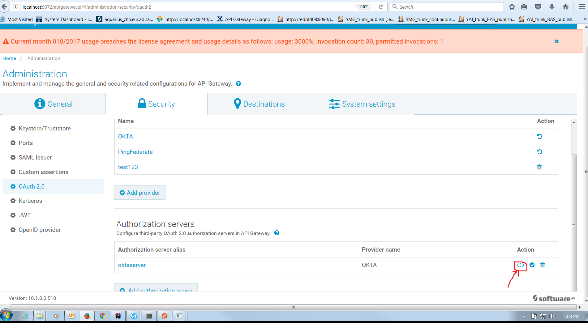

Step 4: Creating a consumer application in API Gateway
------------------------------------------------------

Now lets create an application in API Gateway.

Go to Applications. Click on Create application button, provide the application details and Save it.

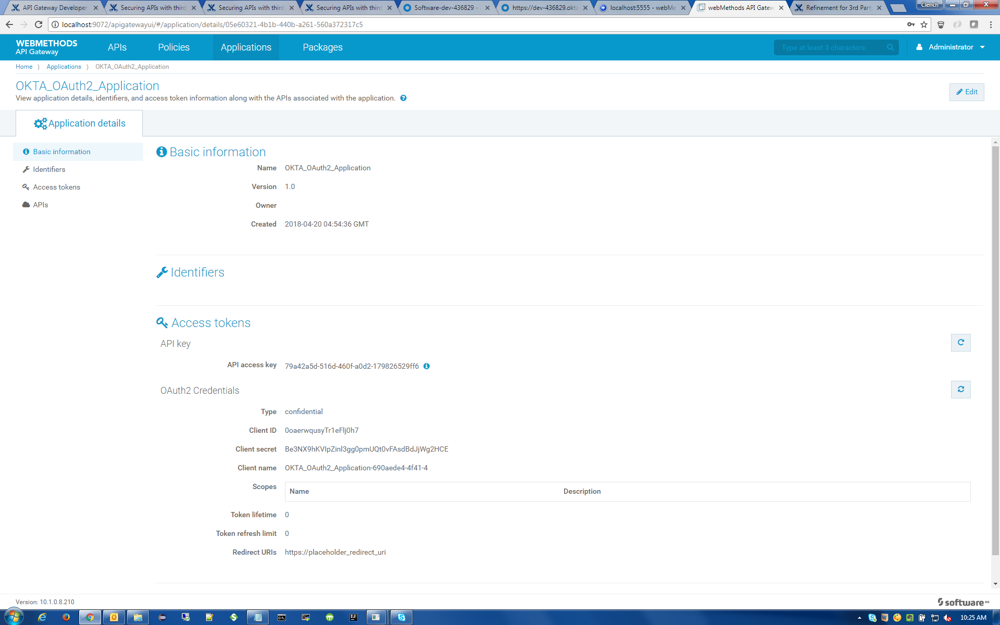

  

When the application is created, the API Gateway invokes the Client registration endpoint in the OKTA authorization server (which we created in Step 1) and an application (client registration) is created in OKTA. Then the Gateway retrieves the Client ID, Client secret, Scopes and other OAuth 2 related client registration details from the OKTA server and saves them in the API Gateway application.

The below screeshot shows the application (Client registration) created as part of this API Gateway applcation creation.

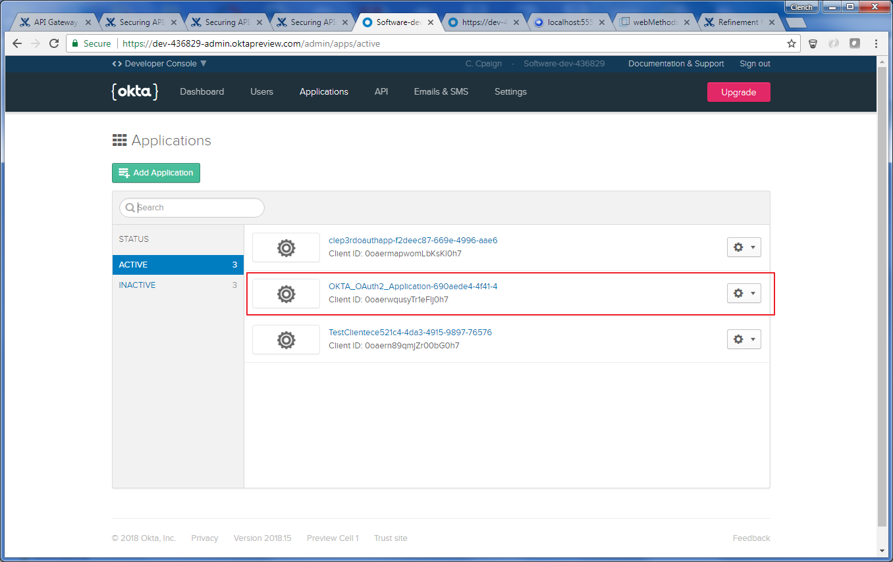

Step 5: Configuring external authorization server in Integration Server
-----------------------------------------------------------------------

Now we need to add an External Authorization Server alias in the Integration Server which is the Resource server in this context. Integration Server uses the introspection endpoint provided in this alias to check if the access tokens sent in the client requests are currently active or not before granting access to the OAuth 2 protected APIs in API Gateway.

In 10.2 and above this external authorization server configuration can be done in API Gateway UI instead of Integration Server's administration page. Please find the screenshot below.

  

Go to Security → OAuth → Add External Authorization Server and enter the below details.

**Name** → The OKTA authorization server name we created in API Gateway in Step 3

**Introspection Endpoint** → The endpoint with the key "introspection\_endpoint" which we obtained by accessing the Metadata URI in Step 1. This is used by the Integration Server (resource server) to validate an access token or a refresh token prior to granting access to a OAuth 2 protected API request.

**Client Id** → The Client Id from the API Gateway application we created

**Client Secret** → The Client Secret from the API Gateway application we created

**User** → An IS user

  

Step 6: Invoking the OAuth 2 protected API using postman client
---------------------------------------------------------------

Now we are all set to add OAuth 2 protection to the REST API in API Gateway and invoke it using the postman client.

### Redirection URI

Edit the consumer application which we created in Step 4 and add this URL [https://www.getpostman.com/oauth2/callback](https://www.getpostman.com/oauth2/callback) in the **Redirection URIs** under **OAuth2 Credentials** and **Save** the application.

### Adding IAM - OAuth 2 policy in API Gateway API

Edit the REST API which was created as part of the prerequisite steps and add the **Identify & Authorize Application** policy with the **OAuth2 Token** as the Identification type.

  

  

Go to **Applications** tab and add the OKTA consumer application we created in Step 4. Save the API and activate it.

  

When the API is saved an OAuth 2 scope is created in the OKTA authorization server and same is added to the Scopes in the API Gateway consumer application.

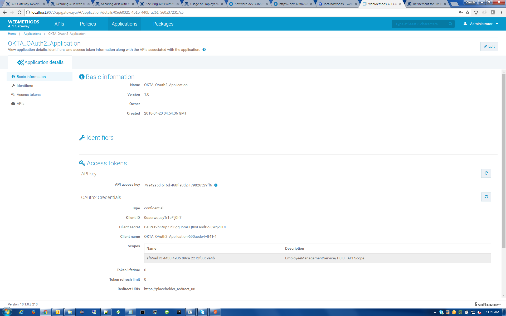

  

You can see the below screenshot to notice that the scope is created in the OKTA authorization server.

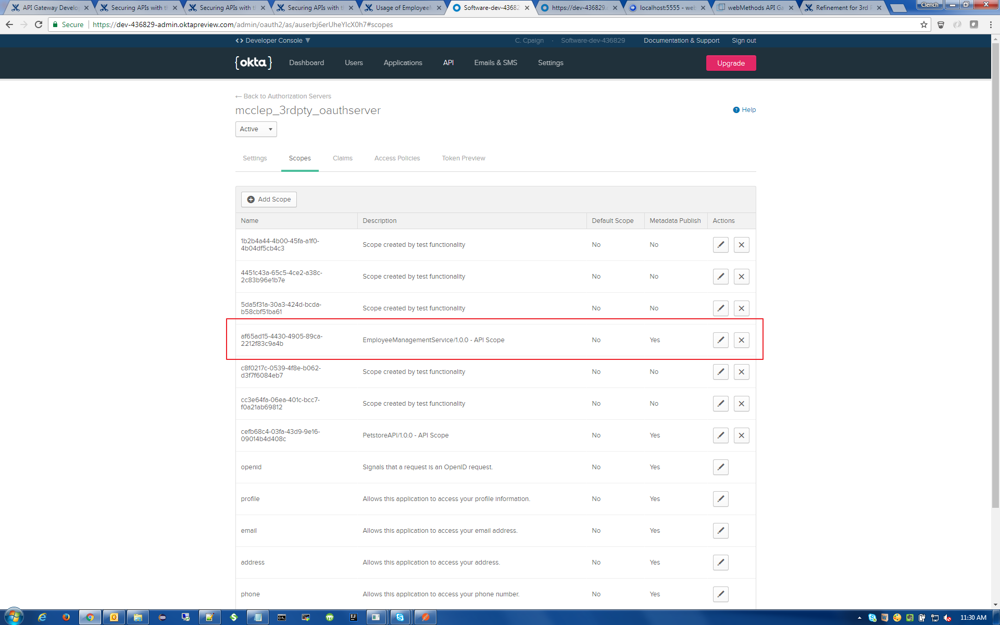

### API Invocation

Now we can invoke the OAuth 2 protected API using the postman client by following the below steps.

#### Obtaining access token from OKTA server

In the postman create a request for the API with OAuth 2.0 selected in the **Authorization** section and click **Get New Access Token**.

You will get a screen like below:

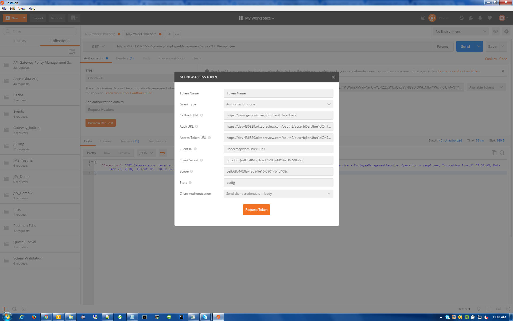

  

Enter all the relevant details such as Auth URL, Access Token URL, Client ID, Client Secret and Scope which we obtained from the OKTA Metadata URI and API Gateway consumer application and click Request Token button.

You will get the OAuth 2 access token as below.

 

  

Click on **Use Token** and click _**Send**_ to send the request to API Gateway API.

The OAuth 2 access token is added as a Bearer token in the Authorization header in the request and sent to the API. A successful response (200 OK) is received from the API.

Now we accessed an OAuth 2 protected API with the use of a third party OAuth 2 provider support in API Gateway.

Limitations
===========

Below are the limitations for the third party OAuth 2 provider support in API Gateway.

*   API Gateway 10.1 supports only OAuth 2.0 
*   OAuth 2 is not supported for WebSocket API
*   The third-party vendor of the authorization server should support RFC 7662, OAuth 2.0 Token Introspection

Troubleshooting
===============

#

Issue

Solution

1

When testing the authorization server alias configuration you may get failures for some of the endpoints like Client Update, Scope

Create, etc.

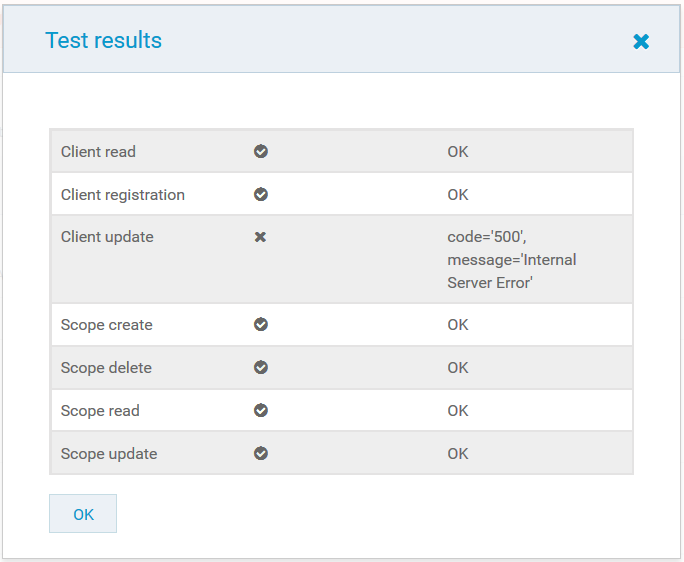

Apply the Fix 8 or above of 10.1

2

When you request a token from the postman client by clicking the Use Token button you may get an error like below

In the postman console you may see the corresponding error message

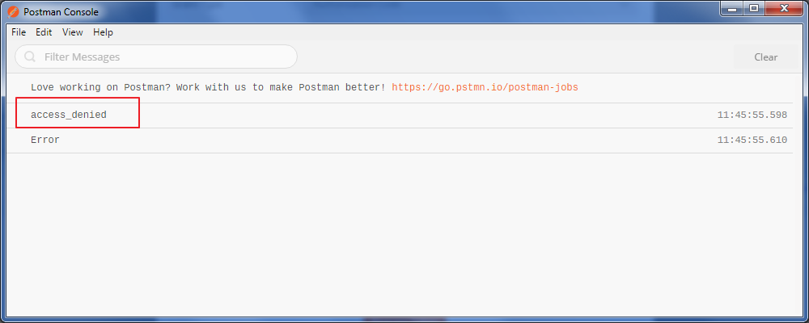

Check the OKTA logs by going to API → System Log

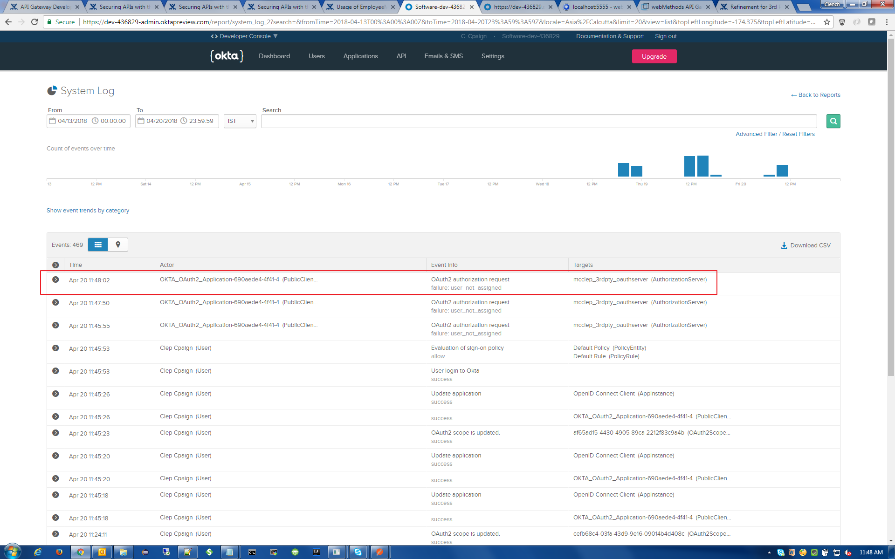

This problem occurs because the ACL is not assigned to the OKTA application (Client registration) in the OKTA authorization server.

This can be solved by assigning an access control group to that application,.

Go to Applications in the OKTA portal and select the OKTA application that was created as part of the API Gateway application creation.

Click Assign and select Assign to Groups. Assign Everyone and click Done.

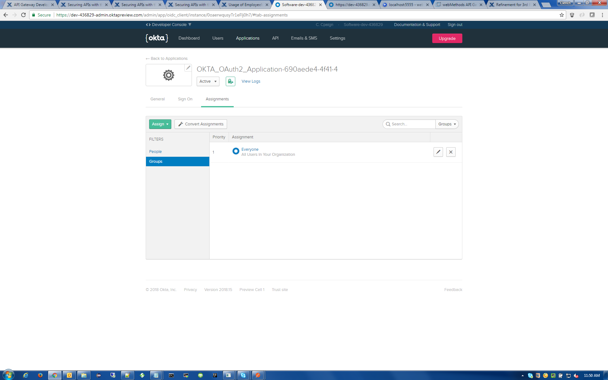

3

When you request a token from the postman client by clicking the Use Token button you may get an error like below

In the postman console you may see the corresponding error message

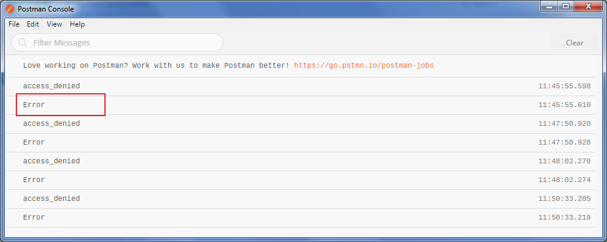

Check the OKTA logs by going to API → System Log

This problem occurs because there was no Access policy and a rule configured in the OKTA authorization server space.

This can be solved by creating an Access policy and a rule in the OKTA authorization server details.

Go to API → Authorization Servers and select the Authorization server.

Go to Access Policies and add a policy and a rule.

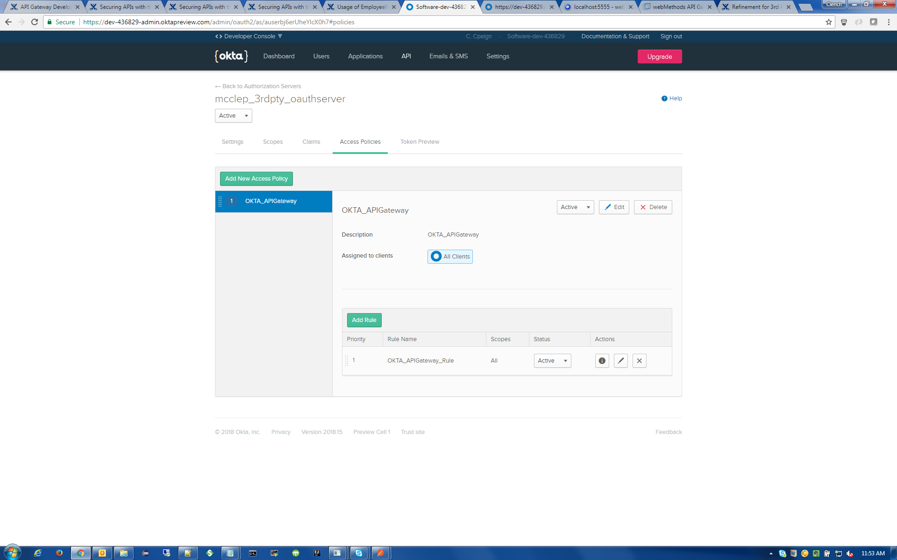  

4

When you request a token from the postman client by clicking the Use Token button you may get an error and

see the error message in the console.

  

In the GET NEW ACCESS TOKEN window of the postman client select "Send client credentials in body" in the Client Authentication.

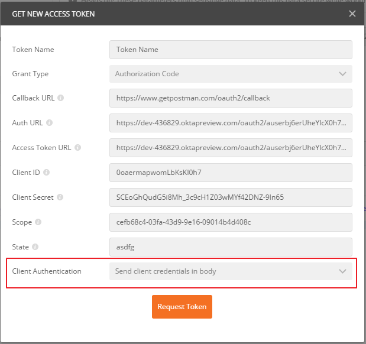

  

References
==========

*   Refer **[An introduction to oauth-2](https://www.digitalocean.com/community/tutorials/an-introduction-to-oauth-2)** for a basic understanding of OAuth 2.0
*   Introspection endpoint: _**[https://www.oauth.com/oauth2-servers/token-introspection-endpoint/](https://www.oauth.com/oauth2-servers/token-introspection-endpoint/)**_
*   _[https://docs.pingidentity.com/bundle/pf\_sm\_pingfederateOauth20Endpoints\_pf82/page/pf\_c\_introspectionEndpoint.html](https://docs.pingidentity.com/bundle/pf_sm_pingfederateOauth20Endpoints_pf82/page/pf_c_introspectionEndpoint.html)  
    _
*   [https://tools.ietf.org/html/rfc7662#section-2](https://tools.ietf.org/html/rfc7662#section-2)

Downloadable artifacts
======================

#### IS Sample services Package - WmEmployeeManagementSample.zip

[WmEmployeeManagementSample.zip](/download/attachments/521242124/WmEmployeeManagementSample.zip?version=1&modificationDate=1524207947727&api=v2)

#### Swagger file for the service - EmployeeManagementSwagger.json

[EmployeeManagementSwagger.json](/download/attachments/521242124/EmployeeManagementSwagger.json?version=1&modificationDate=1524208032197&api=v2)

#### Sample Scope management ESB service

[Default.zip](/download/attachments/521242124/Default.zip?version=1&modificationDate=1524738247560&api=v2)

Learn more
==========

*   [Securing APIs using OpenID Connect in API Gateway](https://iwiki.eur.ad.sag/display/RNDWMGDM/Securing+APIs+using+OpenID+Connect+in+API+Gateway)
*   [Securing APIs with JSON Web Token in API Gateway](https://iwiki.eur.ad.sag/display/RNDWMGDM/Securing+APIs+with+JSON+Web+Token+in+API+Gateway)
*   [Securing API using Kerberos at the Message Level](https://iwiki.eur.ad.sag/display/RNDWMGDM/Securing+API+using+Kerberos+at+the+Message+Level)

  

Attachments:
------------

 [oauth\_roles.png](attachments/521242124/521242132.png) (image/png)  
 [okta-token.png](attachments/521242124/521248421.png) (image/png)  
 [metadata-uris.png](attachments/521242124/521242134.png) (image/png)  
 [endpoints.png](attachments/521242124/521242135.png) (image/png)  
 [endpoint configuration.png](attachments/521242124/521242136.png) (image/png)  
 [test.png](attachments/521242124/521242137.png) (image/png)  
 [test-results.png](attachments/521242124/521242138.png) (image/png)  
 [set\_as\_default.png](attachments/521242124/521242139.png) (image/png)  
 [app\_in\_okta.png](attachments/521242124/521242140.png) (image/png)  
 [app\_in\_apigateway.png](attachments/521242124/521242141.png) (image/png)  
 [image2018-4-19\_16-59-48.png](attachments/521242124/521247772.png) (image/png)  
 [image2018-4-19\_20-47-31.png](attachments/521242124/521248331.png) (image/png)  
 [image2018-4-19\_20-48-23.png](attachments/521242124/521248333.png) (image/png)  
 [okta-token.png](attachments/521242124/521242133.png) (image/png)  
 [image2018-4-19\_22-8-9.png](attachments/521242124/521248424.png) (image/png)  
 [image2018-4-20\_9-20-15.png](attachments/521242124/521248628.png) (image/png)  
 [image2018-4-20\_9-30-27.png](attachments/521242124/521248637.png) (image/png)  
 [image2018-4-20\_9-30-52.png](attachments/521242124/521248639.png) (image/png)  
 [image2018-4-20\_9-31-23.png](attachments/521242124/521248642.png) (image/png)  
 [image2018-4-20\_9-58-7.png](attachments/521242124/521248664.png) (image/png)  
 [image2018-4-20\_9-58-44.png](attachments/521242124/521248666.png) (image/png)  
 [image2018-4-20\_10-1-2.png](attachments/521242124/521248669.png) (image/png)  
 [image2018-4-20\_10-3-14.png](attachments/521242124/521248838.png) (image/png)  
 [image2018-4-20\_10-5-10.png](attachments/521242124/521248839.png) (image/png)  
 [image2018-4-20\_10-10-42.png](attachments/521242124/521248851.png) (image/png)  
 [image2018-4-20\_10-12-18.png](attachments/521242124/521248856.png) (image/png)  
 [image2018-4-20\_10-17-43.png](attachments/521242124/521248861.png) (image/png)  
 [image2018-4-20\_10-25-38.png](attachments/521242124/521248872.png) (image/png)  
 [image2018-4-20\_10-26-56.png](attachments/521242124/521248874.png) (image/png)  
 [image2018-4-20\_10-44-25.png](attachments/521242124/521248899.png) (image/png)  
 [image2018-4-20\_11-25-13.png](attachments/521242124/521248954.png) (image/png)  
 [image2018-4-20\_11-25-50.png](attachments/521242124/521248955.png) (image/png)  
 [image2018-4-20\_11-28-44.png](attachments/521242124/521248960.png) (image/png)  
 [image2018-4-20\_11-30-43.png](attachments/521242124/521248967.png) (image/png)  
 [image2018-4-20\_11-40-49.png](attachments/521242124/521249030.png) (image/png)  
 [image2018-4-20\_11-58-30.png](attachments/521242124/521249124.png) (image/png)  
 [image2018-4-20\_11-58-51.png](attachments/521242124/521249127.png) (image/png)  
 [image2018-4-20\_11-59-23.png](attachments/521242124/521249131.png) (image/png)  
 [image2018-4-20\_12-3-29.png](attachments/521242124/521249166.png) (image/png)  
 [image2018-4-20\_12-8-10.png](attachments/521242124/521249180.png) (image/png)  
 [image2018-4-20\_12-9-53.png](attachments/521242124/521249202.png) (image/png)  
 [image2018-4-20\_12-11-45.png](attachments/521242124/521249217.png) (image/png)  
 [image2018-4-20\_12-18-6.png](attachments/521242124/521249233.png) (image/png)  
 [image2018-4-20\_12-18-53.png](attachments/521242124/521249236.png) (image/png)  
 [image2018-4-20\_12-20-8.png](attachments/521242124/521249240.png) (image/png)  
 [image2018-4-20\_12-22-26.png](attachments/521242124/521249244.png) (image/png)  
 [image2018-4-20\_12-27-34.png](attachments/521242124/521249254.png) (image/png)  
 [image2018-4-20\_12-29-37.png](attachments/521242124/521249261.png) (image/png)  
 [image2018-4-20\_12-32-13.png](attachments/521242124/521249277.png) (image/png)  
 [WmEmployeeManagementSample.zip](attachments/521242124/521249290.zip) (application/zip)  
 [EmployeeManagementSwagger.json](attachments/521242124/521249297.json) (application/octet-stream)  
 [image2018-4-20\_13-53-22.png](attachments/521242124/521249492.png) (image/png)  
 [image2018-4-25\_9-57-22.png](attachments/521242124/521256327.png) (image/png)  
 [okta-scope-managment-service.png](attachments/521242124/521257376.png) (image/png)  
 [image2018-4-26\_15-40-3.png](attachments/521242124/521259267.png) (image/png)  
 [Default.zip](attachments/521242124/521259303.zip) (application/zip)  

Document generated by Confluence on Apr 04, 2020 11:16

[Atlassian](http://www.atlassian.com/)