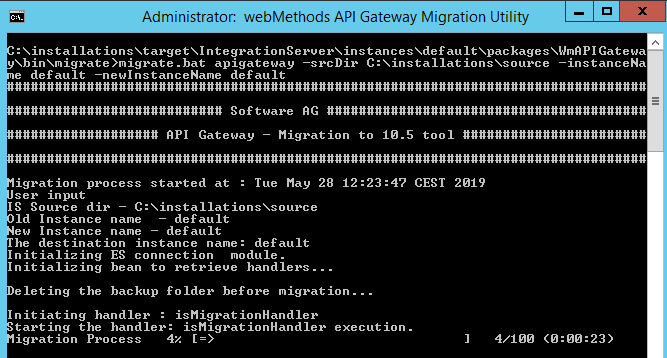

::: {#page}
::: {#main .aui-page-panel}
::: {#main-header}
::: {#breadcrumb-section}
1.  [RnD API Management](index.html)
:::

[ RnD API Management : API Gateway migration steps - Simplified ]{#title-text} {#title-heading .pagetitle}
==============================================================================
:::

::: {#content .view}
::: {.page-metadata}
Created by [ Madharsha, Sadiq]{.author}, last modified by [ James,
Clench Paign]{.editor} on Nov 08, 2019
:::

::: {#main-content .wiki-content .group}
#### Author: [Madharsha, Sadiq](https://iwiki.eur.ad.sag/display/~SADM){.confluence-userlink .user-mention} {#APIGatewaymigrationsteps-Simplified-Author:}

#### Supported Versions: {#APIGatewaymigrationsteps-Simplified-SupportedVersions:}

API Gateway 10.3 Fix 4 and above

Overview of the tutorial {#APIGatewaymigrationsteps-Simplified-Overviewofthetutorial}
========================

API Gateway supports migration of data from older version to newer
versions. [In this tutorial we will go through the following migration
types in detail.]{style="color: rgb(0,0,0);"}

-   Migration using direct mode for standalone
-   Migration using direct mode for cluster
-   Migration using backup mode for standalone
-   Migration using backup mode for cluster

Required knowledge {#APIGatewaymigrationsteps-Simplified-Requiredknowledge}
==================

The tutorial assumes that the reader has,

-   a basic knowledge on the API Gateway as a product
-   a basic understanding on Elasticsearch (Internal Data Store)

Why? {#APIGatewaymigrationsteps-Simplified-Why?}
====

In earlier versions of API Gateway i.e before 10.3 Fix 4 the migration
commands were more complex which involves a multi step process. A lot of
manual steps were needed to perform the migration and adding an overhead
of restarting API Gateway server and Elasticsearch multiple times. In
addition to that the user has to face few more struggles, some of them
are, the migration didn\'t support migration of data from externally
configured Elasticsearch and for any troubleshooting, the user has to
look out multiple locations for the logs instead of single unified
location which is far more easier.

The new migration utility introduced in API Gateway 10.3 Fix 4 will
resolve the below issues.

-   The commands are very simple and few
-   Restart of Elasticsearch and API Gateway server is eliminated
-   Migration of Elasticsearch and IS can be done separately
-   Migration of data from externally configured Elasticsearch is
    supported
-   Logs all the details to a standard file, *migrationLog.txt*, a
    single file for all the log data
-   Supports reverting in case of failure in Elasticsearch migration

Prerequisite steps {#APIGatewaymigrationsteps-Simplified-Prerequisitesteps}
==================

[Complete the below prerequisites before working on
migration.]{style="color: rgb(0,0,0);"}

-   Install source and target API Gateway instances. The version of
    target API Gateway should be higher than source API Gateway.
    Supported source API Gateway versions are 10.1 and above
-   [If custom keystore files are used in the source ]{.Command
    style="color: rgb(0,0,0);"}[API Gateway]{.Command
    style="color: rgb(0,0,0);"}[ installation, copy the files to the
    same location in the target installation]{.Command
    style="color: rgb(0,0,0);"}
-   If the target API Gateway is 10.5, then apply Fix 1

Details {#APIGatewaymigrationsteps-Simplified-Details}
=======

The migration of API Gateway can be done in two ways.

#### 1. Direct  mode {#APIGatewaymigrationsteps-Simplified-1.Directmode}

This is done by running the migration utility by referring to source
Elasticsearch connection properties for migrating Elasticsearch data and
the source API Gateway installation directory for migrating the IS
configuration data. If the source and target Elasticsearch instances are
running in the same network and can talk to each other then this method
is preferred.

#### 2. Backup mode {#APIGatewaymigrationsteps-Simplified-2.Backupmode}

This is done by running the migration utility by referring to the backup
of source Elasticsearch data and the source API Gateway configuration
backup file for migrating both the Elasticsearch data and the IS
configuration. If the source and target Elasticsearch instances are
running in different network and not able to talk to each other then
this method is preferred.

[Throughout this tutorial we refer source API Gateway installation
directory as ]{style="letter-spacing: 0.0px;"}**\<SOURCE\>, **[target
API Gateway installation directory as
]{style="letter-spacing: 0.0px;"}**\<TARGET\> **and target elasticsearch
is **\<TARGET\_ELASTIC\_SEARCH\>**

::: {.confluence-information-macro .confluence-information-macro-information}
Note

[]{.aui-icon .aui-icon-small .aui-iconfont-info
.confluence-information-macro-icon}

::: {.confluence-information-macro-body}
    In API Gateway 10.2 and above the folder name "EventDataStore" has been changed to "InternalDataStore".
:::
:::

Migration using direct mode for standalone {#APIGatewaymigrationsteps-Simplified-Migrationusingdirectmodeforstandalone}
------------------------------------------

In this scenario we will be migrating a standalone API Gateway to a
higher version using direct mode. The steps are given below.

### Step 1 {#APIGatewaymigrationsteps-Simplified-Step1}

Configure the below property in the target elasticsearch.yml file
located
at ***\<TARGET\>\\InternalDataStore\\config*** for [re-indexing the data
in the target Elasticsearch. ]{style="color: rgb(53,64,82);"}[The below
property [helps to copy the documents from **\<SOURCE\>** to
**\<TARGET\>** Elasticsearch
instance.]{style="color: rgb(68,68,68);"}]{style="color: rgb(53,64,82);"}

::: {.code .panel .pdl style="border-width: 1px;"}
::: {.codeHeader .panelHeader .pdl style="border-bottom-width: 1px;"}
**elasticsearch.yml**
:::

::: {.codeContent .panelContent .pdl}
``` {.syntaxhighlighter-pre syntaxhighlighter-params="brush: java; gutter: false; theme: Confluence" theme="Confluence"}
reindex.remote.whitelist: <source_host>:<source_port>
(This value should match with the value of the property pg.gateway.elasticsearch.hosts present in 
<SOURCE>\IntegrationServer\instances\default\packages\WmAPIGateway\config\resource\elasticsearch\config.properties)
```
:::
:::

For example, the below file contains *localhost:9240* for
*reindex.remote.whitelist* property.

[{.confluence-embedded-image
height="220"}]{.confluence-embedded-file-wrapper
.confluence-embedded-manual-size}

### Step 2 (Optional) {#APIGatewaymigrationsteps-Simplified-Step2(Optional)}

::: {.confluence-information-macro .confluence-information-macro-information}
[]{.aui-icon .aui-icon-small .aui-iconfont-info
.confluence-information-macro-icon}

::: {.confluence-information-macro-body}
This step is applicable only if the source API Gateway version is 10.1. 
From 10.2  these values are populated automatically.
:::
:::

[Configure source Elasticsearch host and port details in the file
***config.properties*** file which is located
at ]{style="color: rgb(0,0,0);"}***\<SOURCE\>\\IntegrationServer\\instances\\default\\packages\\WmAPIGateway\\config\\resources\\elasticsearch***[.]{style="color: rgb(0,0,0);"}

::: {.code .panel .pdl style="border-width: 1px;"}
::: {.codeHeader .panelHeader .pdl style="border-bottom-width: 1px;"}
**config.properties**
:::

::: {.codeContent .panelContent .pdl}
``` {.syntaxhighlighter-pre syntaxhighlighter-params="brush: java; gutter: false; theme: Confluence" theme="Confluence"}
pg.gateway.elasticsearch.hosts=<source_host>:<source_port>
```
:::
:::

### Step 3 {#APIGatewaymigrationsteps-Simplified-Step3}

If the source Elasticsearch is protected with basic authentication add
the below properties
in ***\<SOURCE\>\\IntegrationServer\\instances\\default\\packages\\WmAPIGateway\\config\\resources\\elasticsearch\\config.properties***** **file.

::: {.code .panel .pdl style="border-width: 1px;"}
::: {.codeHeader .panelHeader .pdl style="border-bottom-width: 1px;"}
**config.properties**
:::

::: {.codeContent .panelContent .pdl}
``` {.syntaxhighlighter-pre syntaxhighlighter-params="brush: java; gutter: false; theme: Confluence" theme="Confluence"}
pg.gateway.elasticsearch.http.username=<username>
pg.gateway.elasticsearch.http.password=<password>
```
:::
:::

### Step 4 {#APIGatewaymigrationsteps-Simplified-Step4}

If the source Elasticsearch is protected with HTTPS, add the source
certificates (public key) in to the target Elasticsearch JVM\'s
truststore. For e.g, In case of internal data store we need to add the
public keys to the truststore cacerts file located
at ***\<TARGET\>\\jvm\\jvm\\jre\\lib\\security***.

::: {.confluence-information-macro .confluence-information-macro-information}
Note

[]{.aui-icon .aui-icon-small .aui-iconfont-info
.confluence-information-macro-icon}

::: {.confluence-information-macro-body}
If external Elasticsearch is used for the target API Gateway then the
certificates should be imported to its corresponding JVM
:::
:::

Below is a sample command to import the truststore of source
Elasticsearch in to target Elasticsearch JVM.

***\$\<TARGET\>\\jvm\\jvm\\bin\\keytool -import -keystore
\<TARGET\>\\jvm\\jvm\\jre\\lib\\security\\cacerts -file
\<truststore.jks\>-alias \<alias\>***

::: {.table-wrap}
+-------+-------------------------------------------------------+------+
| Pro   | Detail                                                | Exa  |
| perty |                                                       | mple |
+=======+=======================================================+======+
| \<t   | Truststore used in \<SOURCE\> Elasticsearch. Provide  | *    |
| rusts | the full path of the truststore.                      | sagc |
| tore. |                                                       | onfi |
| jks\> | \                                                     | g/ro |
|       |                                                       | ot-c |
|       | For 10.1 it should be available at                    | a.jk |
|       | *C:\\installation\\source\\Int                        | s**\ |
|       | egrationServer\\instances\\default\\packages\\WmAPIGa | ***  |
|       | teway\\config\\resources\\bean\\gateway-es-store.xml* |      |
|       |                                                       |      |
|       | property ***\<prop                                    |      |
|       | key=\"searchguard.ssl.http.trus                       |      |
|       | tstore\_filepath\"\>sagconfig/root-ca.jks\</prop\>*** |      |
|       |                                                       |      |
|       | ***\                                                  |      |
|       | ***                                                   |      |
|       |                                                       |      |
|       | For 10.2 and above it will be available at            |      |
|       | *C:\\installation\\source\\Integrati                  |      |
|       | onServer\\instances\\default\\packages\\WmAPIGateway\ |      |
|       | \config\\resources\\elasticsearch\\config.properties* |      |
|       |                                                       |      |
|       | property                                              |      |
|       | ***                                                   |      |
|       | pg.gateway.elasticsearch.https.truststore.filepath*** |      |
|       |                                                       |      |
|       | \                                                     |      |
+-------+-------------------------------------------------------+------+
| \<al  | This is the alias used in \<SOURCE\> Elasticsearch    | wm   |
| ias\> |                                                       | .sag |
|       |                                                       | .com |
+-------+-------------------------------------------------------+------+
:::

### Step 5 {#APIGatewaymigrationsteps-Simplified-Step5}

Start both source and target Elasticsearch instances and make sure that
IS instances are NOT started. Also avoid Elasticsearch port conflict.

::: {.confluence-information-macro .confluence-information-macro-warning}
Avoid port conflict

[]{.aui-icon .aui-icon-small .aui-iconfont-error
.confluence-information-macro-icon}

::: {.confluence-information-macro-body}
If source and target API Gateway instances are running in the same
machine, then the user might not able to start both the source and
target Elasticsearch instances in parallel with the default port
configurations. In that case the target Elasticsearch instance port can
be changed temporarily for running the migration. Both HTTP and TCP
ports must be changed. Follow the below steps.

1.  Go to *\<TARGET\>/InternalDataStore/config directory*, open the
    *elasticsearch.yml* file, and change the value of the HTTP port in
    the *http.port* property and the TCP port in the
    *transport.tcp.port* and *discovery.zen.ping.unicast.hosts*
    properties
2.  Go to
    *\<TARGET\>/IntegrationServer/instances/default/packages/WmAPIGateway/config/resources/elasticsearch*
    directory, open the *config.properties* file and find the
    *pg.gateway.elasticsearch.hosts* property. If the property is set to
    *changeOnInstall* then you need to do nothing further. If there is a
    port configured already, update it to a new value
:::
:::

### Step 6 {#APIGatewaymigrationsteps-Simplified-Step6}

Now we will start running the migration process. The migration process
consist of migration of Elasticsearch data and API Gateway
configurations and both will be done by running the migration utility
command at \<TARGET\> API Gateway machine.

In this step we will migrate the Elasticsearch data. 

Go to
*\<TARGET\>\\IntegrationServer\\instances\\default\\packages\\WmAPIGateway\\bin\\migrate*
and run the below command.

[{.confluence-embedded-image
width="515"}]{.confluence-embedded-file-wrapper
.confluence-embedded-manual-size}

***\$\> migrate.bat datastore -dstoreSrc \<full path to source
Elasticsearch config.properties\>***

::: {.table-wrap}
+-----+----------------------------------------------------------------+
| Par | Description                                                    |
| ame |                                                                |
| ter |                                                                |
+=====+================================================================+
| dst | If source and target API Gateway instances are running in the  |
| ore | same network. Provide the location where \<SOURCE\>            |
| Src | config.properties file is located.                             |
|     |                                                                |
|     | Sample:                                                        |
|     |                                                                |
|     | *migrate.bat datastore                                         |
|     | -dstoreSrc * *\<SOU                                            |
|     | RCE\>\\IntegrationServer\\instances\\default\\packages\\WmAPIG |
|     | ateway\\config\\resources\\elasticsearch\\config.properties*** |
+-----+----------------------------------------------------------------+
| \   | If the source and target instances are running in different    |
|     | machines, the the source installation directory or at least    |
|     | the Elasticsearch *config.properties* file must be shared in   |
|     | the network. Otherwise just copy and paste the source          |
|     | config.properties to the shared location.                      |
|     |                                                                |
|     | Sample:                                                        |
|     |                                                                |
|     | *migrate.bat datastore                                         |
|     | -dstoreSrc * \\\\chebackup01\\installations*\                  |
|     | \source\\IntegrationServer\\instances\\default\\packages\\WmAP |
|     | IGateway\\config\\resources\\elasticsearch\\config.properties* |
+-----+----------------------------------------------------------------+
:::

***\
\$\> migrate.bat datastore
-dstoreSrc *** \\\\chebackup01\\installations***\\source\\IntegrationServer\\instances\\default\\packages\\WmAPIGateway\\config\\resources\\elasticsearch\\config.properties***

***[{.confluence-embedded-image
width="500"}]{.confluence-embedded-file-wrapper
.confluence-embedded-manual-size}***

### Step 7 {#APIGatewaymigrationsteps-Simplified-Step7}

In this step we will migrate the Integration Server\'s configuration to
target instance. Go
to *\<TARGET\>\\IntegrationServer\\instances\\default\\packages\\WmAPIGateway\\bin\\migrate* and
run the below command.

***\$\> migrate.bat apigateway -srcDir \<SOURCE\> -instanceName \<source
instance name\> -newInstanceName \<target instance name\>***

\

::: {.table-wrap}
+---------+---------------------------------------------+--------------+
| Pa      | Description                                 | Sample       |
| rameter |                                             | command      |
+=========+=============================================+==============+
| s       | If the source API Gateway instance is       | **-srcDir    |
| rcDir   | installed in the same network, provide the  | C:\          |
|         | source API Gateway installation directory   | \installatio |
|         |                                             | ns\\source*\ |
|         |                                             | *            |
+---------+---------------------------------------------+--------------+
| \       | If the source API Gateway instance is       | ***-srcDir   |
|         | installed in a different network, then      | **\\\\       |
|         | share the entire installation folder        | chebackup01\ |
|         |                                             | \source***** |
+---------+---------------------------------------------+--------------+
| insta   | This is an optional parameter. Here we need | *-i          |
| nceName | to pass \<SOURCE\> instance name.           | nstanceName  |
|         |                                             | default*     |
|         | If you don\'t provide any name then         |              |
|         | *default* will be assigned. If you want to  | *-i          |
|         | migrate different instance other            | nstanceName  |
|         |                                             | dev*         |
|         | than *default* provide its name. (To know   |              |
|         | more about Integration server instances     | *-i          |
|         | please refer its doc)                       | nstanceName  |
|         |                                             | test*        |
+---------+---------------------------------------------+--------------+
| n       | This is an optional parameter. Here we need | *-new        |
| ewInsta | to pass \<TARGET\> instance name.           | InstanceName |
| nceName |                                             | default*     |
|         | If you don\'t provide any name then         |              |
|         | *default* will be assigned. If you have     | *-new        |
|         | created a new instance other than *default* | InstanceName |
|         |                                             | qa*          |
|         | in Integration server and you want to       |              |
|         | migrate to the new instance then provide    | *-new        |
|         | its name.                                   | InstanceName |
|         |                                             | prod*        |
+---------+---------------------------------------------+--------------+
:::

***\
***A sample run command is given below.

***\$\> migrate.bat  apigateway  -srcDir  C:\\installations\\source 
-instanceName  default  -newInstanceName default***

[{.confluence-embedded-image
height="250"}]{.confluence-embedded-file-wrapper
.confluence-embedded-manual-size}

***[{.confluence-embedded-image
width="466"}]{.confluence-embedded-file-wrapper
.confluence-embedded-manual-size}\
***

### Step 8 {#APIGatewaymigrationsteps-Simplified-Step8}

This is a post migration step. Follow the below steps.

-   Shutdown all Elasticsearch instances
-   Start API Gateway server
-   You can find the logs  at target
    directory  ***\<TARGET\>/install/logs/migrationLog.txt ***
-   You can find the API Gateway migration reports
    at  ***\<TARGET\>\\install\\logs\\APIGW\_Migration\_Reports\_\<date\_time\>***

Migration using direct mode for cluster {#APIGatewaymigrationsteps-Simplified-Migrationusingdirectmodeforcluster}
---------------------------------------

This is very similar to the standalone migration except the following
differences.

-   Go to \<SOURCE\>\\InternalDataStore\\config and configure
    ***path.repo*** property in elasticsearch.yml file for all the
    nodes. Make sure that the *path.repo* is a shared network folder and
    should be accessible for all the Elasticsearch nodes in the
    cluster. 
-   Follow Step 1 all the target Elasticsearch instances in the cluster
-   Follow Step 6 in only one node in the cluster
-   Follow Step 7 for all API Gateway target nodes in the cluster

Before running the migration, setup the target Elasticsearch cluster and
make sure that all the source and target Elasticsearch instances in the
clusters are up and running with the exception that the API Gateway
instances should not be started on any of the nodes.

Migration using backup mode for standalone {#APIGatewaymigrationsteps-Simplified-Migrationusingbackupmodeforstandalone}
------------------------------------------

In this scenario we will be migrating a standalone API Gateway to a
higher version using backup mode. The steps are given below.

::: {.confluence-information-macro .confluence-information-macro-information}
Target API Gateway is 10.5

[]{.aui-icon .aui-icon-small .aui-iconfont-info
.confluence-information-macro-icon}

::: {.confluence-information-macro-body}
If the target API Gateway version is 10.5, this Backup mode is not
supported to migrate Elasticsearch data due to the fact that the
Elasticsearch version would be different in source API Gateway i.e less
than 7.2.0. As per the Elasticsearch documentation, restoring a backup
which is taken from a version less than 7.2.0 (for e.g 5.6.4), into
version 7.2.0 is not supported. As a workaround to this, please follow
these steps.

-   Install a temporary Elasticsearch of a version which is supported by
    the source API Gateway in a machine and make it accessible to the
    target API Gateway instance, i.e, the target Elasticsearch 7.2.0.
-   Start the temporary Elasticsearch.
-   Restore the \<SOURCE\> Elasticsearch backup into the temporarily
    running Elasticsearch by following the steps given in this section
    (*Migration using backup mode for standalone*).
-   After that, use the temporary Elasticsearch instance as the source
    Elasticsearch and migrate the Elasticsearch data to the \<TARGET\>
    API Gateway (10.5) using Direct mode followed by Step 7.
:::
:::

\

::: {.confluence-information-macro .confluence-information-macro-information}
TARGET\_ELASTIC\_SEARCH

[]{.aui-icon .aui-icon-small .aui-iconfont-info
.confluence-information-macro-icon}

::: {.confluence-information-macro-body}
In this section, if the \<TARGET\> version is 10.5,
***\<TARGET\_ELASTIC\_SEARCH\>*** refers to the location of the
temporarily running Elasticsearch. For versions less than 10.5,
***\<TARGET\_ELASTIC\_SEARCH\>*** refers to
\<TARGET\>/InternalDataStore.
:::
:::

### Step 1 {#APIGatewaymigrationsteps-Simplified-Step1.1}

Go to ***\<SOURCE\>\\InternalDataStore\\config*** and configure
*path.repo* property in *elasticsearch.yml* file. ***path.repo*** is an
elastic search property and it helps us to create a repository in the
Elasticsearch where the backup data will be stored. This step would help
preparing the \<SOURCE\> Elasticsearch to store the data in this
location.

[{.confluence-embedded-image
width="515"}]{.confluence-embedded-file-wrapper
.confluence-embedded-manual-size}

### Step 2 {#APIGatewaymigrationsteps-Simplified-Step2}

Start the \<SOURCE\> Elasticsearch instance.

### Step 3 {#APIGatewaymigrationsteps-Simplified-Step3.1}

Now lets take the backup of source API Gateway data. Go
to ***\<SOURCE\>\\IntegrationServer\\instances\\default\\packages\\WmAPIGateway\\cli\\bin*** and
run the below command.

***\$\> apigw-upgrade-backup.bat -backupDestinationDirectory
\<path\_to\_data\_store\_backup\_folder\>  -backupFileName \<backup\_file\_name\_without\_spaces\_for\_the\_zip\>***

*[{.confluence-embedded-image
width="515"}]{.confluence-embedded-file-wrapper
.confluence-embedded-manual-size}*

::: {.table-wrap}
+-------------+------------------------------+-------------------------+
| Parameter   | Description                  | Sample command          |
+=============+==============================+=========================+
| *backup     | Same network. The location   | ::: {.content-wrapper}  |
| Destination | where the cumulative backup  | **-bac                  |
| Directory * | data will get stored. Make   | kupDestinationDirectory |
|             | sure                         | C:\\mi                  |
|             |                              | gration\\backupFolder*\ |
|             | the directory is already     | *                       |
|             | created before executing the | :::                     |
|             | command.                     |                         |
+-------------+------------------------------+-------------------------+
| *back       | Backup file name. The name   | *-backupFileName        |
| upFileName* | of the .zip file that will   | backupzipfile\          |
|             | be created as part of the    | *                       |
|             | backup command               |                         |
|             |                              |                         |
|             | execution. Make sure the     |                         |
|             | backup file name is          |                         |
|             | specified in lower case      |                         |
+-------------+------------------------------+-------------------------+
:::

\
Example,

******\$\> ***apigw-upgrade-backup.bat -backupDestinationDirectory
C:\\migration\\backupfolder -backupFileName backupzipfile ***

::: {.confluence-information-macro .confluence-information-macro-information}
Note

[]{.aui-icon .aui-icon-small .aui-iconfont-info
.confluence-information-macro-icon}

::: {.confluence-information-macro-body}
Make sure the backup destination directory is already created and the
backup file name be specified in lower case.
:::
:::

\
[{.confluence-embedded-image
width="415"}]{.confluence-embedded-file-wrapper
.confluence-embedded-manual-size}

After the command is run successfully, the backup directory would
contain the Elasticsearch data folder which is stored with the tenant
name (for our use case it is *default*) and API Gateway configuration
data as a zip file (for our use case it is *backupzipfile.zip*) as seen
in the below screenshot. The Elasticsearch data folder is copied from
the location we configured in Step 1 by the command.

[{.confluence-embedded-image}]{.confluence-embedded-file-wrapper}

### Step 4 {#APIGatewaymigrationsteps-Simplified-Step4.1}

1.  After the backup command is executed and the backup is done, stop
    the \<SOURCE\> Elasticsearch.  

2.  Now go to ***\<TARGET\_ELASTIC\_SEARCH\>\\config*** and
    configure *path.repo* property in *elasticsearch.yml* file and start
    the \<TARGET\> Elasticsearch instance.

### Step 5 {#APIGatewaymigrationsteps-Simplified-Step5.1}

When the **\<TARGET\_ELASTIC\_SEARCH\>** is up and running, invoke the
below RESP API to create a repository in the \<TARGET\> machine with
tenant name.

``` {.programlisting .prettyprint .lang-js .prettyprinted}
PUT /_snapshot/tenant_name
```

``` {.programlisting .prettyprint .lang-js .prettyprinted}
{ "type": "fs", "settings": { "location": <tenant_name> } }
```

\

For e.g if we want to create \'a repo for \'default\' as tenant name,
then the command would be as below.

PUT 
 [http://localhost:9240/\_snapshot/default ]{style="color: rgb(80,80,80);"}

``` {.programlisting .prettyprint .lang-js .prettyprinted}
{ "type": "fs", "settings": { "location": "default" } }
```

After the REST API invocation, a folder with the tenant name (in our use
case it is *default*) will be created under the *path.repo* folder.

### Step 6 {#APIGatewaymigrationsteps-Simplified-Step6.1}

This is a preparation step for Elasticsearch data migration. Go
to ***backupDestinationDirectory/\<tenant\_name\>*** directory in Step 3
and copy the contents from Elasticsearch data folder (with tenant
name) to the repository folder created in Step 5.

For e.g the below is the Elasticsearch data folder for our use case.

**[{.confluence-embedded-image
width="515"}]{.confluence-embedded-file-wrapper
.confluence-embedded-manual-size}**

The below is the target repository folder under *path.repo*.

**[{.confluence-embedded-image
width="515"}]{.confluence-embedded-file-wrapper
.confluence-embedded-manual-size}**

### Step 7 {#APIGatewaymigrationsteps-Simplified-Step7.1}

Once the above prerequisites are ready we are now ready to run the
migration commands to migrate the Elasticsearch data and the API Gateway
configurations. In this step we will migrate the Elasticsearch data.

#### **For \<TARGET\> API Gateway 10.5** {#APIGatewaymigrationsteps-Simplified-For<TARGET>APIGateway10.5}

[Restore the snapshot using the following command in the target
instance]{style="color: rgb(52,55,65);"}

*curl -X POST \"localhost:9240/\_snapshot/[\<]{.pln
style="color: rgb(0,0,0);"}tenant\_name\>/\<backupFileName\>/\_restore\"*

For e.g if we want to create a repo with \'default\' as tenant name,
then the command would be as below.

*POST [[http://localhost:9240/\_snapshot/default]{.nolink}/[backupzipfile/\_restore]{style="color: rgb(80,80,80);"}]{style="color: rgb(80,80,80);"}*

[[As the restore command is asynchronous, you can check its status by
using the below
command]{style="color: rgb(80,80,80);"}]{style="color: rgb(80,80,80);"}

*[[http://localhost:9240/\_cluster/health?pretty]{style="color: rgb(80,80,80);"}]{style="color: rgb(80,80,80);"}*

[[The restore would be completed successfully when the health status
becomes yellow from
red. ]{style="color: rgb(80,80,80);"}]{style="color: rgb(80,80,80);"}[Now
use this temporary Elasticsearch as source Elasticsearch and migrate the
Elasticsearch data by direct mode as mentioned in the section
\']{style="color: rgb(80,80,80);"}*Migration using direct mode for
standalone*\'

#### **For \<TARGET\> API Gateway below 10.5** {#APIGatewaymigrationsteps-Simplified-For<TARGET>APIGatewaybelow10.5}

Go
to *\<TARGET\>\\IntegrationServer\\instances\\default\\packages\\WmAPIGateway\\bin\\migrate *directory
and run the below command.

*****\$\> migrate.bat datastore*****

*****[{.confluence-embedded-image
width="415"}]{.confluence-embedded-file-wrapper
.confluence-embedded-manual-size}*****

After command is run the data store data will be migrated.

### Step 8 {#APIGatewaymigrationsteps-Simplified-Step8.1}

After successful migration of Elasticsearch data, run API Gateway
configurations migration using the below command.

*****\$\> migrate.bat apigateway -srcFile \<backupLoc\>  fileName.zip 
-instanceName \<old instance name\> -newInstanceName \<new instance
name\>*****

::: {.table-wrap}
+---------+------------------------------------+----------------------+
| Pa      | Description                        | Sample command       |
| rameter |                                    |                      |
+=========+====================================+======================+
| **src   | Provide the .zip file location     | **-srcFile           |
| File* * | that were created as part of       | C:\\migr             |
|         | backup process. This can also be a | ation\\backupfolder\ |
|         | shared network file.               | \backupzipfile.zip** |
+---------+------------------------------------+----------------------+
| ***i    | This is optional parameter. Here   | *-instanceName       |
| nstance | we need to pass \<SOURCE\>         | default *            |
| Name*** | instance name .                    |                      |
|         |                                    | **-*instanceName*    |
|         | If you don\'t provide any name     | test*\               |
|         | then \'default\' will be assigned. | *                    |
|         | If you want to migrate different   |                      |
|         | instance other                     | \                    |
|         |                                    |                      |
|         | than default, please provide its.  |                      |
|         | (To know more about Integration    |                      |
|         | server instances please refer its  |                      |
|         | doc)                               |                      |
+---------+------------------------------------+----------------------+
| *ne     | This is optional parameter. Here   | *-newInstanceName    |
| wInstan | we need to pass \<TARGET\>         | default*             |
| ceName* | instance name .                    |                      |
|         |                                    | *-newInstanceName    |
|         | If you don\'t provide any name     | prod*                |
|         | then \'default\' will be assigned. |                      |
|         | If you have created a new instance |                      |
|         | other than default                 |                      |
|         |                                    |                      |
|         | in Integration server and you want |                      |
|         | to migrate to the new instance     |                      |
|         | then please provide its name for   |                      |
|         | -newInstanceName option            |                      |
+---------+------------------------------------+----------------------+
:::

\

For e.g *****\$\> migrate.bat apigateway -srcFile
C:\\migration\\backupfolder\\backupzipfile.zip -instanceName default
-newInstanceName default*****

*****[{.confluence-embedded-image
width="415"}]{.confluence-embedded-file-wrapper
.confluence-embedded-manual-size}*****

*****\
*****

*****[{.confluence-embedded-image
width="415"}]{.confluence-embedded-file-wrapper
.confluence-embedded-manual-size}*****

Now the API Gateway configurations are migrated.

### Step 9 {#APIGatewaymigrationsteps-Simplified-Step9}

This is a post migration step. Follow the below steps.

-   Shutdown the \<TARGET\> Elasticsearch instance
-   Start the \<TARGET\> API Gateway server

Migration using backup mode for cluster {#APIGatewaymigrationsteps-Simplified-Migrationusingbackupmodeforcluster}
---------------------------------------

In this scenario we will be migrating a clustered API Gateway to a
higher version using backup mode. This is very similar to the standalone
migration except few differences. The steps are given below.

::: {.confluence-information-macro .confluence-information-macro-information}
Target API Gateway is 10.5

[]{.aui-icon .aui-icon-small .aui-iconfont-info
.confluence-information-macro-icon}

::: {.confluence-information-macro-body}
If the target API Gateway version is 10.5, this Backup mode is not
supported to migrate Elasticsearch data due to the fact that the
Elasticsearch version would be different in source API Gateway i.e less
than 7.2.0. As per the Elasticsearch documentation, restoring a backup
which is taken from a version less than 7.2.0 (for e.g 5.6.4), into
version 7.2.0 is not supported. As a workaround to this, please follow
these steps.

-   Install a temporary Elasticsearch of a version which is supported by
    the source API Gateway in a machine and make it accessible to the
    target API Gateway instance, i.e, the target Elasticsearch 7.2.0.
-   Start the temporary Elasticsearch.
-   Restore the \<SOURCE\> Elasticsearch backup into the temporarily
    running Elasticsearch by following the steps given in this section
    (*Migration using backup mode for cluster*).
-   After that, use the temporary Elasticsearch instance as the source
    Elasticsearch and migrate the Elasticsearch data to the \<TARGET\>
    API Gateway (10.5) using Direct mode followed by Step 8.
:::
:::

\

::: {.confluence-information-macro .confluence-information-macro-information}
TARGET\_ELASTIC\_SEARCH

[]{.aui-icon .aui-icon-small .aui-iconfont-info
.confluence-information-macro-icon}

::: {.confluence-information-macro-body}
In this section, if the \<TARGET\> version is 10.5,
***\<TARGET\_ELASTIC\_SEARCH\>*** refers to the location of the
temporarily running Elasticsearch. For versions less than 10.5,
***\<TARGET\_ELASTIC\_SEARCH\>*** refers to
\<TARGET\>/InternalDataStore.
:::
:::

### Step 1 {#APIGatewaymigrationsteps-Simplified-Step1.2}

Before running the migration, setup the target Elasticsearch cluster and
make sure that all the source and target Elasticsearch instances in the
clusters are up and running with the exception that the API Gateway
instances should not be started on any of the nodes.

### Step 2 {#APIGatewaymigrationsteps-Simplified-Step2.1}

Go to ***\<SOURCE\>\\InternalDataStore\\config*** and
configure *path.repo* property in *elasticsearch.yml* file. Do this for
all the nodes. Note that Note that *path.repo* should be a shared
network folder and should be accessible for all the Elasticsearch nodes
in the cluster. 

### Step 3 {#APIGatewaymigrationsteps-Simplified-Step3.2}

Start all the \<SOURCE\> Elasticsearch instances.

### Step 4 {#APIGatewaymigrationsteps-Simplified-Step4.2}

Now lets take the backup of source API Gateway data. Go to any one of
the Elasticsearch nodes
location***\<SOURCE\>\\IntegrationServer\\instances\\default\\packages\\WmAPIGateway\\cli\\bin*** and
run the below command.

***\$\> apigw-upgrade-backup.bat -backupDestinationDirectory
\<path\_to\_data\_store\_backup\_folder\>  -backupFileName \<backup\_file\_name\_without\_spaces\_for\_the\_zip\>***

For Example,

******\$\> ***apigw-upgrade-backup.bat -backupDestinationDirectory
C:\\migration\\backupfolder -backupFileName backupzipfile ***

::: {.confluence-information-macro .confluence-information-macro-information}
Note

[]{.aui-icon .aui-icon-small .aui-iconfont-info
.confluence-information-macro-icon}

::: {.confluence-information-macro-body}
Make sure the backup destination directory is already created and the
backup file name be specified in lower case.
:::
:::

\
After the command is run successfully, the backup directory would
contain the Elasticsearch data folder which is stored with the tenant
name (for our use case it is *default*) and API Gateway configuration
data as a zip file (for our use case it is *backupzipfile.zip*) as seen
in the below screenshot. The Elasticsearch data folder is copied from
the location we configured in Step 1 by the command.

[{.confluence-embedded-image}]{.confluence-embedded-file-wrapper}

### Step 5 {#APIGatewaymigrationsteps-Simplified-Step5.2}

1.  After the backup command is executed and the backup is done, stop
    all the \<SOURCE\> Elasticsearch nodes. 

2.  Now go to ***\<TARGET\_ELASTIC\_SEARCH\>\\config*** and
    configure *path.repo* property in *elasticsearch.yml* file for all
    the \<TARGET\> Elasticsearch nodes. Start any one of the \<TARGET\>
    Elasticsearch nodes.

### Step 6 {#APIGatewaymigrationsteps-Simplified-Step6.2}

When the **\<TARGET\_ELASTIC\_SEARCH\>** is up and running, invoke the
below RESP API to create a repository in the \<TARGET\> machine with
tenant name.

``` {.programlisting .prettyprint .lang-js .prettyprinted}
PUT /_snapshot/tenant_name
```

``` {.programlisting .prettyprint .lang-js .prettyprinted}
{ "type": "fs", "settings": { "location": <tenant_name> } }
```

\

For e.g if we want to create \'a repo for \'default\' as tenant name,
then the command would be as below.

PUT 
 [<http://localhost:9240/_snapshot/default> ]{style="color: rgb(80,80,80);"}

``` {.programlisting .prettyprint .lang-js .prettyprinted}
{ "type": "fs", "settings": { "location": "default" } }
```

After the REST API invocation, a folder with the tenant name (in our use
case it is *default*) will be created under the *path.repo* folder.

### Step 7 {#APIGatewaymigrationsteps-Simplified-Step7.2}

This is a preparation step for Elasticsearch data migration. Go
to ***backupDestinationDirectory/\<tenant\_name\>*** directory in Step 3
and copy the contents from Elasticsearch data folder (with tenant
name) to the shared repository folder created in Step 5.

For e.g the below is the Elasticsearch data folder for our use case.

**[{.confluence-embedded-image
width="515"}]{.confluence-embedded-file-wrapper
.confluence-embedded-manual-size}**

### Step 8 {#APIGatewaymigrationsteps-Simplified-Step8.2}

Once the above prerequisites are ready we are now ready to run the
migration commands to migrate the Elasticsearch data and the API Gateway
configurations. In this step we will migrate the Elasticsearch data.

#### **For \<TARGET\> API Gateway 10.5** {#APIGatewaymigrationsteps-Simplified-For<TARGET>APIGateway10.5.1}

[Restore the snapshot using the following command in the target
instance]{style="color: rgb(52,55,65);"}

*curl -X POST \"localhost:9240/\_snapshot/[\<]{.pln
style="color: rgb(0,0,0);"}tenant\_name\>/\<backupFileName\>/\_restore\"*

For e.g if we want to create a repo with \'default\' as tenant name,
then the command would be as below.

*POST [[[http://localhost:9240/\_snapshot/default]{.nolink}]{.nolink}/backupzipfile/\_restore]{style="color: rgb(80,80,80);"}*

[As the restore command is asynchronous, you can check its status by
using the below command]{style="color: rgb(80,80,80);"}

*[http://localhost:9240/\_cluster/health?pretty]{style="color: rgb(80,80,80);"}*

[The restore would be completed successfully when the health status
becomes yellow from red. ]{style="color: rgb(80,80,80);"}[Now use this
temporary Elasticsearch as source Elasticsearch and migrate the
Elasticsearch data by direct mode as mentioned in the section
\']{style="color: rgb(80,80,80);"}*Migration using direct mode for
standalone*\'[ in any one of the cluster
nodes]{style="letter-spacing: 0.0px;"}

#### **For \<TARGET\> API Gateway below 10.5** {#APIGatewaymigrationsteps-Simplified-For<TARGET>APIGatewaybelow10.5.1}

Go
to *\<TARGET\>\\IntegrationServer\\instances\\default\\packages\\WmAPIGateway\\bin\\migrate *directory
in any one of the cluster nodes and run the below command.

***\$\> migrate.bat datastore***

After command is run the data store data will be migrated.

### Step 9 {#APIGatewaymigrationsteps-Simplified-Step9.1}

After successful migration of Elasticsearch data, run API Gateway
configurations migration using the below command.

***\$\> migrate.bat apigateway -srcFile \<backupLoc\>  fileName.zip 
-instanceName \<old instance name\> -newInstanceName \<new instance
name\>***

[For e.g ]{style="letter-spacing: 0.0px;"}***\$\> migrate.bat apigateway
-srcFile C:\\migration\\backupfolder\\backupzipfile.zip -instanceName
default -newInstanceName default***

Now the API Gateway configurations are migrated. This should be done for
all the API Gateway nodes in the cluster.

### Step 10 {#APIGatewaymigrationsteps-Simplified-Step10}

This is a post migration step. Follow the below steps.

-   Shutdown the \<TARGET\> Elasticsearch instances
-   (Optional) If Elasticsearch nodes are configured externally to API
    Gateway nodes, Start all those externally configured Elasticsearch
    nodes to setup the cluster
-   Start the \<TARGET\> API Gateway nodes

Migration configuration {#APIGatewaymigrationsteps-Simplified-Migrationconfiguration}
-----------------------

API Gateway customers can modify certain parameters for migration based
on their requirements by modifying the property file
***migration.properties*** which is located at
\<*TARGET\>\\IntegrationServer\\instances\\default\\packages\\WmAPIGateway\\bin\\migrate*.
This property file is instance specific and customers can have different
configurations while migrating different instances.

::: {.table-wrap}
+---+--------------------+-----------------------------+-----+----------+
| \ | Property           | Description                 | D   | Possible |
| # |                    |                             | efa | values   |
|   |                    |                             | ult |          |
|   |                    |                             | va  |          |
|   |                    |                             | lue |          |
+===+====================+=============================+=====+==========+
| 1 | apigateway.migra   | By default, the source      | d   | Any      |
|   | tion.srcTenantName | tenant is assumed as        | efa | a        |
|   |                    | default. But If the source  | ult | vailable |
|   |                    | API Gateway has multiple    |     | tenant   |
|   |                    | tenants, this property can  |     | in       |
|   |                    | be used to specify the      |     | Elast    |
|   |                    | tenant name from which the  |     | icsearch |
|   |                    | data has to be migrated to  |     |          |
|   |                    | the target tenant.          |     |          |
+---+--------------------+-----------------------------+-----+----------+
| 2 | apigateway.m       | The batch size with which   | 100 | App      |
|   | igration.batchSize | the data is processed. For  |     | ropriate |
|   |                    | e.g if size is 100 then by  |     | batch    |
|   |                    | default 100 documents will  |     | size. It |
|   |                    | be processed first. If the  |     | depends  |
|   |                    | network is slow we can      |     | on the   |
|   |                    | decrease this value and if  |     | number   |
|   |                    | the network is better we    |     | of       |
|   |                    | can increase this value.    |     | d        |
|   |                    |                             |     | ocuments |
|   |                    |                             |     | and the  |
|   |                    |                             |     | size of  |
|   |                    |                             |     | the      |
|   |                    |                             |     | d        |
|   |                    |                             |     | ocuments |
|   |                    |                             |     | in the   |
|   |                    |                             |     | data     |
|   |                    |                             |     | store    |
+---+--------------------+-----------------------------+-----+----------+
| 3 | apigateway.        | Log level for migration. we | i   | inf      |
|   | migration.logLevel | can change log level to     | nfo | o,debug, |
|   |                    | debug, error etc.           |     | error,wa |
|   |                    |                             |     | rn,trace |
+---+--------------------+-----------------------------+-----+----------+
| 4 | ap                 | Interval configuration in   | 5   | App      |
|   | igateway.migration | milliseconds. Once the      | 000 | ropriate |
|   | .reindex.status.ch | re-indexing process has     |     | sleep    |
|   | eck.sleep.interval | started from source to      |     | interval |
|   |                    | target instances, migration |     |          |
|   |                    | process will wake up after  |     |          |
|   |                    | every configured sleep      |     |          |
|   |                    | interval to check whether   |     |          |
|   |                    | the re-indexing is          |     |          |
|   |                    | complete. It will check the |     |          |
|   |                    | status of the task id       |     |          |
+---+--------------------+-----------------------------+-----+----------+
:::

Recovery {#APIGatewaymigrationsteps-Simplified-Recovery}
--------

During migration, if there is any problem in the execution or any of the
handlers got failed, to make sure that assets are migrated properly, we
can clean the target instance once and then re run the migration. This
clean command will clean the target data store  (the one configured in
the config.properties of target machine) . During this procedure all the
indices will be removed and this is a non reversible action. Before
cleaning the data we will also take a backup of the existing data (you
can also restore it). Once cleaned, we can re-run the migration. Also
once you trigger the clean command, this process will wait for 5 seconds
and if you wrongly triggered it and you want to kill this process you
can do that with in that 5 seconds interval.

**[{.confluence-embedded-image
height="250"}]{.confluence-embedded-file-wrapper
.confluence-embedded-manual-size}**

### Clean command {#APIGatewaymigrationsteps-Simplified-Cleancommand .title}

::: {.confluence-information-macro .confluence-information-macro-information}
Before running clean command

[]{.aui-icon .aui-icon-small .aui-iconfont-info
.confluence-information-macro-icon}

::: {.confluence-information-macro-body}
If the \<TARGET\> is 10.5 and the clean command is executed in a
cluster, go to \<SOURCE\>\\InternalDataStore\\config and
configure ***path.repo*** property in elasticsearch.yml file for all the
nodes. Make sure that the *path.repo* is a shared network folder and
should be accessible for all the Elasticsearch nodes in the cluster. 
:::
:::

Go to
*\<TARGET\>\\IntegrationServer\\instances\\default\\packages\\WmAPIGateway\\bin\\migrate *and
run the below command.

*****\$\> migrate.bat clean*****

::: {.confluence-information-macro .confluence-information-macro-warning}
[]{.aui-icon .aui-icon-small .aui-iconfont-error
.confluence-information-macro-icon}

::: {.confluence-information-macro-body}
Since this command removes all the assets from data store, make sure
that the target data store is properly configured in config.properties
which is located at
\<TARGET\>\\IntegrationServer\\instances\\default\\packages\\WmAPIGateway\\config\\resources\\elasticsearch.
:::
:::

Troubleshooting {#APIGatewaymigrationsteps-Simplified-Troubleshooting}
===============

::: {.table-wrap}
+---+---------------------------------------+-----+--------+------------+
| \ | Issue Description                     | Sc  | Reason | Remedy     |
| # |                                       | ena |        |            |
|   |                                       | rio |        |            |
|   |                                       | n   |        |            |
|   |                                       | ame |        |            |
+===+=======================================+=====+========+============+
| 1 | ElasticsearchException\[Error while   | Dir | Remote | Add the    |
|   | reindexing APIs. Error type -         | ect | re-in  | below      |
|   | illegal\_argument\_exception,         | -   | dexing | property   |
|   |                                       | S   | pr     | in         |
|   | reason \[localhost:1240\] not         | tan | operty | \<TARGET\> |
|   | whitelisted in                        | dal | missed | elastic    |
|   | reindex.remote.whitelist\]            | one | in     | search.yml |
|   |                                       |     | target |            |
|   |                                       |     | elast  | reind      |
|   |                                       |     | icsear | ex.remote. |
|   |                                       |     | ch.yml | whitelist: |
|   |                                       |     |        | \<s        |
|   |                                       |     |        | ourcehost\ |
|   |                                       |     |        | >:\<source |
|   |                                       |     |        | httpport\> |
+---+---------------------------------------+-----+--------+------------+
| 2 | Exception thrown during migration     | Dir | Wrong  | datastore/ |
|   | operation. Exiting the operation.     | ect | c      | apigateway |
|   |                                       | -   | ommand | argument   |
|   | No Such command - -srcDir             | S   | usage  | must be    |
|   |                                       | tan |        | passed     |
|   |                                       | dal |        |            |
|   |                                       | one |        | mig        |
|   |                                       |     |        | ration.bat |
|   |                                       |     |        | apigateway |
|   |                                       |     |        | -srcDir    |
|   |                                       |     |        | C:\\Softwa |
|   |                                       |     |        | reAG\_10.1 |
|   |                                       |     |        | -in        |
|   |                                       |     |        | stanceName |
|   |                                       |     |        | default    |
|   |                                       |     |        | -newIn     |
|   |                                       |     |        | stanceName |
|   |                                       |     |        | default    |
+---+---------------------------------------+-----+--------+------------+
| 3 | Deleting the backup folder before     | Bac | Exi    | Delete the |
|   | migration\... Migration Process 0%    | kup | stence | isExtract  |
|   | \[\>\] 0/100 (0:00:00)                | -   | of     | folder in  |
|   | java.io.FileNotFoundException:        | S   | isE    | C:\\\<\<I  |
|   | 15:41:13.580 \[main\] ERROR           | tan | xtract | nstallatio |
|   | com.soft                              | dal | file   | nDir\>\>\\ |
|   | wareag.apigateway.utility.command.bac | one | due to |            |
|   | kup.instance.BackupApiGatewayInstance |     | mig    |            |
|   | - Error occurred while trying to      |     | ration |            |
|   | parse the Manifest file to obtain the |     | f      |            |
|   | version information.                  |     | ailure |            |
|   | java.io.FileNotFoundException:(The    |     | of     |            |
|   | system cannot find the file           |     | pr     |            |
|   | specified)                            |     | evious |            |
|   |                                       |     | steps  |            |
+---+---------------------------------------+-----+--------+------------+
| 4 | elasticsearchclient bean creation     | All | Make   | \          |
|   | exception                             |     | sure   |            |
|   |                                       |     | the    |            |
|   |                                       |     | resp   |            |
|   |                                       |     | ective |            |
|   |                                       |     | E      |            |
|   |                                       |     | lastic |            |
|   |                                       |     | search |            |
|   |                                       |     | nodes  |            |
|   |                                       |     | is     |            |
|   |                                       |     | r      |            |
|   |                                       |     | unning |            |
+---+---------------------------------------+-----+--------+------------+
| 5 | \[2018-12-19T12:34:03,892\]\[WARN     | Bac | Make   | Configure  |
|   | \                                     | kup | sure   | single     |
|   | ]\[o.e.r.VerifyNodeRepositoryAction\] | M   | pat    | common     |
|   |                                       | ode | h.repo | shared     |
|   | \[[SAG-2KXG                           | -   | is a   | path in    |
|   | BH2.eur.ad](http://sag-2kxgbh2.eur.ad | C   | single | elastic    |
|   | /){.external-link}.sag1544697848038\] | lus | common | search.yml |
|   | \[default\] failed to verify          | ter | lo     | (          |
|   | repository                            |     | cation | path.repo) |
|   |                                       |     | rea    |            |
|   | org.elasticsearch.reposito            |     | chable |            |
|   | ries.RepositoryVerificationException: |     | and    |            |
|   | \[default\] a file written by master  |     | acce   |            |
|   | to the store                          |     | ssible |            |
|   | \[C:\\SoftwareAG\_10.3\\I             |     | by all |            |
|   | nternalDataStore\\dasoSnap\\default\] |     | other  |            |
|   | cannot be accessed on the node        |     | nodes  |            |
|   | \[{[SAG-2KX                           |     |        |            |
|   | GBH2.eur.ad](http://sag-2kxgbh2.eur.a |     |        |            |
|   | d/){.external-link}.sag1544697848038} |     |        |            |
|   | {yL84xqhZQS                           |     |        |            |
|   | uFfUmj0GrFbQ}{uGv-BmTBT6e8LCpOsxpGOg} |     |        |            |
|   | {10.60.37.18}{10.60.37.18:9340}\].    |     |        |            |
|   | This might indicate that the store    |     |        |            |
|   | \[C:\\SoftwareAG\_10.3\\I             |     |        |            |
|   | nternalDataStore\\dasoSnap\\default\] |     |        |            |
|   | is not shared between this node and   |     |        |            |
|   | the master node or that permissions   |     |        |            |
|   | on the store don\'t allow reading     |     |        |            |
|   | files written by the master node      |     |        |            |
+---+---------------------------------------+-----+--------+------------+
| 6 | The system cannot find the path       | All | Make   | Make sure  |
|   | specified                             |     | sure   | that you   |
|   |                                       |     | that   | are        |
|   |                                       |     | the    | running    |
|   |                                       |     | bat    | the bat    |
|   |                                       |     | from   | from the   |
|   |                                       |     | the    | proper     |
|   |                                       |     | proper | location   |
|   |                                       |     | lo     |            |
|   |                                       |     | cation |            |
+---+---------------------------------------+-----+--------+------------+
| 7 | 2019-10-16 11:59:36 ERROR             | All | The    | Try with a |
|   | ESDataStoreHandler:327 -              |     | size   | smaller    |
|   | {\"type\":\"illegal\_argu             |     | of the | batch size |
|   | ment\_exception\",\"reason\":\"Remote |     | doc    | number     |
|   | responded with a chunk that was too   |     | uments | (a         |
|   | large. Use a smaller batch            |     | se     | pigateway. |
|   | size.\",\"ca                          |     | lected | migration. |
|   | used\_by\":{\"type\":\"content\_too\_ |     | for    | batchSize) |
|   | long\_exception\",\"reason\":\"entity |     | rein   |            |
|   | content is too long \[185463385\] for |     | dexing |            |
|   | the configured buffer limit           |     | as per |            |
|   | \[104857600\]\"}}                     |     | the    |            |
|   |                                       |     | batch  |            |
|   |                                       |     | size   |            |
|   |                                       |     | c      |            |
|   |                                       |     | onfigu |            |
|   |                                       |     | ration |            |
|   |                                       |     | is     |            |
|   |                                       |     | large  |            |
+---+---------------------------------------+-----+--------+------------+
| 8 | [Error while getting task details for | All | When   | Have       |
|   | taks id -                             |     | the    | sufficient |
|   | 6L6RMNEOQF64lQbNeI7J\_g:683354.       |     | space  | space      |
|   | Message -                             |     | in     |            |
|   | task ]                                |     | m      |            |
|   | {style="color: rgb(51,51,51);"}[\[6L6 |     | achine |            |
|   | RMNEOQF64lQbNeI7J\_g:683354\]]{.error |     | is     |            |
|   | s                                     |     | less   |            |
|   | tyle="color: rgb(51,51,51);"}[ isn\'t |     | than   |            |
|   | running and hasn\'t stored its        |     | 10% ,  |            |
|   | re                                    |     | e      |            |
|   | sults]{style="color: rgb(51,51,51);"} |     | lastic |            |
|   |                                       |     | search |            |
|   |                                       |     | marks  |            |
|   |                                       |     | index  |            |
|   |                                       |     | as     |            |
|   |                                       |     | re     |            |
|   |                                       |     | adonly |            |
|   |                                       |     | hence  |            |
|   |                                       |     | r      |            |
|   |                                       |     | eindex |            |
|   |                                       |     | task   |            |
|   |                                       |     | fails  |            |
|   |                                       |     | ab     |            |
|   |                                       |     | ruptly |            |
+---+---------------------------------------+-----+--------+------------+
:::

References {#APIGatewaymigrationsteps-Simplified-References}
==========

-   <https://www.elastic.co/guide/en/elasticsearch/reference/current/index.html>
-   <https://www.elastic.co/guide/en/elasticsearch/reference/master/docs-reindex.html>

Learn more {#APIGatewaymigrationsteps-Simplified-Learnmore}
==========

-   For backup and restore
    refer <https://iwiki.eur.ad.sag/display/RNDWMGDM/Back+up+and+restore+of+API+Gateway+assets>

**\
**

<div>

*\
*

</div>
:::

::: {.pageSection .group}
::: {.pageSectionHeader}
Attachments: {#attachments .pageSectionTitle}
------------
:::

::: {.greybox align="left"}
{width="8" height="8"}
[image2019-5-15\_14-19-56.png](attachments/574199119/582950434.png)
(image/png)\
{width="8" height="8"}
[image2019-5-20\_18-3-2.png](attachments/574199119/584876506.png)
(image/png)\
{width="8" height="8"}
[image2019-5-27\_16-51-52.png](attachments/574199119/585440800.png)
(image/png)\
{width="8" height="8"}
[image2019-5-27\_18-8-42.png](attachments/574199119/585440980.png)
(image/png)\
{width="8" height="8"}
[image2019-5-27\_18-8-56.png](attachments/574199119/585440981.png)
(image/png)\
{width="8" height="8"}
[image2019-5-28\_15-52-33.png](attachments/574199119/585442840.png)
(image/png)\
{width="8" height="8"}
[image2019-5-28\_15-55-0.png](attachments/574199119/585442845.png)
(image/png)\
{width="8" height="8"}
[image2019-5-28\_15-55-59.png](attachments/574199119/585442848.png)
(image/png)\
{width="8" height="8"}
[image2019-5-28\_16-5-45.png](attachments/574199119/585442876.png)
(image/png)\
{width="8" height="8"}
[image2019-5-28\_16-6-30.png](attachments/574199119/585442877.png)
(image/png)\
{width="8" height="8"}
[image2019-5-28\_16-8-56.png](attachments/574199119/585442892.png)
(image/png)\
{width="8" height="8"}
[image2019-5-28\_16-9-1.png](attachments/574199119/585442893.png)
(image/png)\
{width="8" height="8"}
[image2019-5-28\_16-11-23.png](attachments/574199119/585442904.png)
(image/png)\
{width="8" height="8"}
[image2019-5-28\_16-17-7.png](attachments/574199119/585442914.png)
(image/png)\
{width="8" height="8"}
[image2019-5-28\_16-19-33.png](attachments/574199119/585442921.png)
(image/png)\
{width="8" height="8"}
[image2019-5-28\_16-22-41.png](attachments/574199119/585442926.png)
(image/png)\
{width="8" height="8"}
[image2019-5-28\_16-22-59.png](attachments/574199119/585442927.png)
(image/png)\
{width="8" height="8"}
[image2019-5-28\_16-25-29.png](attachments/574199119/585442935.png)
(image/png)\
{width="8" height="8"}
[image2019-5-28\_16-28-12.png](attachments/574199119/585442940.png)
(image/png)\
{width="8" height="8"}
[image2019-5-28\_16-28-59.png](attachments/574199119/585442941.png)
(image/png)\
{width="8" height="8"}
[image2019-5-28\_16-38-54.png](attachments/574199119/585442955.png)
(image/png)\
{width="8" height="8"}
[image2019-5-28\_16-39-57.png](attachments/574199119/585442958.png)
(image/png)\
{width="8" height="8"}
[image2019-5-28\_16-40-37.png](attachments/574199119/585442962.png)
(image/png)\
{width="8" height="8"}
[image2019-5-28\_17-27-35.png](attachments/574199119/585443060.png)
(image/png)\
{width="8" height="8"}
[image2019-10-15\_14-19-37.png](attachments/574199119/615416386.png)
(image/png)\
{width="8" height="8"}
[image2019-10-15\_14-20-11.png](attachments/574199119/615416387.png)
(image/png)\
:::
:::

::: {.pageSection .group}
::: {.pageSectionHeader}
Comments: {#comments .pageSectionTitle}
---------
:::

+-----------------------------------------------------------------------+
| []{#comment-615430738}                                                |
|                                                                       |
| Few comments,                                                         |
|                                                                       |
| Direct mode:                                                          |
|                                                                       |
| In step 1, After configuring the reindex property in the elastic      |
| search config file. We should restart the elastic search to get the   |
| changes reflected. Please mention it.                                 |
|                                                                       |
| Backup mode:                                                          |
|                                                                       |
| In step 6, The snapshot query payload is wrong. \"[location]{.str     |
| style="color: rgb(0,136,0);"}\" should provide any one of the dir     |
| locations which has been listed under \"path.repo\" property in       |
| Elasticsearch.yml file. This property is basically to associate the   |
| repository which we are creating to a special \"Path. repo\"          |
| location. It should not be a tenant name.                             |
|                                                                       |
| \                                                                     |
|                                                                       |
| Upgradation to 10.5 using backup mode is a little bit different than  |
| the earlier versions. In the case of 10.5, we need to restore the     |
| data to the local ES 5.6 instance and then do direct mode. It\'s not  |
| just backup mode so the existing direct mode document which is idealy |
| for reindexing from source GW to destination GW will be confusing and |
| it would be better if you have a separate page specific to 10.5.      |
|                                                                       |
| \                                                                     |
|                                                                       |
| Regards,                                                              |
|                                                                       |
| Sailesh V                                                             |
|                                                                       |
| \                                                                     |
|                                                                       |
| \                                                                     |
|                                                                       |
|                                                                       |
|                                                                       |
| ::: {.smallfont a                                                     |
| lign="left" style="color: #666666; width: 98%; margin-bottom: 10px;"} |
| {width="16" height="16"} |
| Posted by SAIV at Oct 24, 2019 14:13                                  |
| :::                                                                   |
+-----------------------------------------------------------------------+
:::
:::
:::

::: {#footer role="contentinfo"}
::: {.section .footer-body}
Document generated by Confluence on Apr 04, 2020 14:46

::: {#footer-logo}
[Atlassian](http://www.atlassian.com/)
:::
:::
:::
:::
